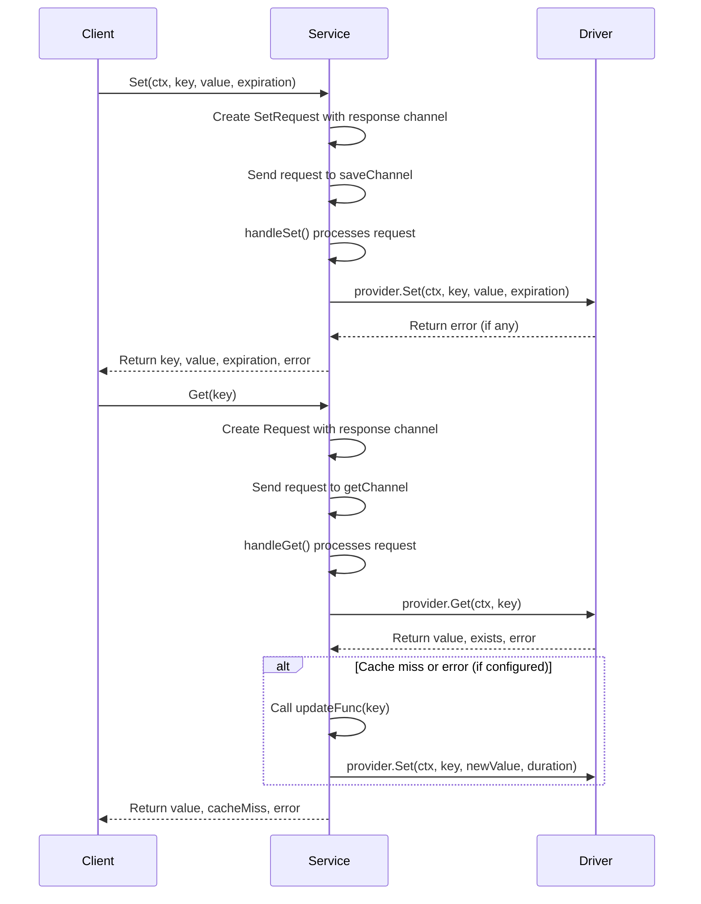

# pcache - PixieCache

A high-performance, concurrent, and generic caching solution for Go applications.

## Overview

pcache provides a channel-based caching system with support for automatic refreshing of expired entries.
It's designed to be used in high-concurrency environments and leverages Go's type parameters for type safety.

## Architecture

Below is the updated Mermaid diagram representing the core components and their relationships:



## Key Components

### Driver Interface

The core abstraction that defines the operations a cache provider must implement:

```go
type Driver[T any] interface {
    Set(ctx context.Context, key string, value T, expiration time.Duration) error
    Get(ctx context.Context, key string) (T, bool, error)
    Delete(ctx context.Context, key string) error
    TTL(ctx context.Context, key string) (time.Time, bool, error)
    Keys(ctx context.Context) ([]string, error)
}
```

### MemoryCache Implementation

An in-memory implementation of the Driver interface that stores values with their expiration times.

### CacheService

Provides a high-level interface for cache operations through channels:

- Asynchronous processing of get/set operations
- Automatic refresh of expired entries
- Periodic cleanup of expired entries

## Usage

### Creating a Cache Service

```go
import (
"context"
"time"
"github.com/pixie-sh/pcache"
)

// Create an update function for refreshing expired cache entries
updateFunc := func (key string) (UserData, time.Duration, error) {
    // In a real application, you'd fetch fresh data here
    fmt.Printf("Updating expired key: %s\n", key)
    return UserData{
    ID:      123,
    Name:    "Updated User",
    Profile: "Updated Profile",
    }, 30 * time.Minute, nil
}

// Create the memory cache provider
memCache := NewMemoryCache[UserData]()

// Create the cache service with 10 second cleanup interval
cacheService := NewService[UserData](memCache, updateFunc, ServiceConfiguration{
    CleanupInterval:   10 * time.Second,
    UpdateOnCacheMiss: true,
    UpdateOnGetError:  false,
})


var ctx = context.Background()
defer cacheService.Close()
cacheService.StartAsync(ctx)
```


### Tests

````
Starting concurrency tests...

=== Running Low Concurrency Test ===

Results for Low Concurrency:
- Total operations: 88412
- Get operations: 53194 (60.2%)
- Save operations: 35218 (39.8%)
- Errors: 0 (0.0%)
- Operations per second: 17682.40
- Key statistics:
  - Unique keys accessed: 50
  - Average accesses per key: 1768.24
  - Min accesses to a key: 1668
  - Max accesses to a key: 1883
- Latency:
  - Average: 1.604µs
  - Min: 83ns
  - Max: 292.375µs

=== Running Medium Concurrency Test ===

Results for Medium Concurrency:
- Total operations: 429861
- Get operations: 258165 (60.1%)
- Save operations: 171696 (39.9%)
- Errors: 0 (0.0%)
- Operations per second: 85972.20
- Key statistics:
  - Unique keys accessed: 50
  - Average accesses per key: 8597.22
  - Min accesses to a key: 8384
  - Max accesses to a key: 8816
- Latency:
  - Average: 30.045µs
  - Min: 166ns
  - Max: 6.011709ms

=== Running High Concurrency Test ===

Results for High Concurrency:
- Total operations: 889292
- Get operations: 532831 (59.9%)
- Save operations: 356461 (40.1%)
- Errors: 0 (0.0%)
- Operations per second: 177858.40
- Key statistics:
  - Unique keys accessed: 50
  - Average accesses per key: 17785.84
  - Min accesses to a key: 17561
  - Max accesses to a key: 18155
- Latency:
  - Average: 30.504µs
  - Min: 125ns
  - Max: 9.897542ms

=== Running Very High Concurrency Test ===

Results for Very High Concurrency:
- Total operations: 1852496
- Get operations: 1112652 (60.1%)
- Save operations: 739844 (39.9%)
- Errors: 0 (0.0%)
- Operations per second: 370499.20
- Key statistics:
  - Unique keys accessed: 50
  - Average accesses per key: 37049.92
  - Min accesses to a key: 36617
  - Max accesses to a key: 37737
- Latency:
  - Average: 26.36µs
  - Min: 42ns
  - Max: 3.742625ms

=== Running Narrow Key Space Test ===

Results for Narrow Key Space:
- Total operations: 848292
- Get operations: 508834 (60.0%)
- Save operations: 339458 (40.0%)
- Errors: 0 (0.0%)
- Operations per second: 169658.40
- Key statistics:
  - Unique keys accessed: 10
  - Average accesses per key: 84829.20
  - Min accesses to a key: 84374
  - Max accesses to a key: 85289
- Latency:
  - Average: 57.424µs
  - Min: 125ns
  - Max: 72.810667ms

=== Running Wide Key Space Test ===

Results for Wide Key Space:
- Total operations: 889458
- Get operations: 533493 (60.0%)
- Save operations: 355965 (40.0%)
- Errors: 0 (0.0%)
- Operations per second: 177891.60
- Key statistics:
  - Unique keys accessed: 1000
  - Average accesses per key: 889.46
  - Min accesses to a key: 788
  - Max accesses to a key: 988
- Latency:
  - Average: 30.315µs
  - Min: 125ns
  - Max: 4.815625ms

All concurrency tests completed!
````